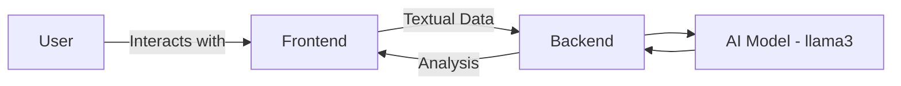
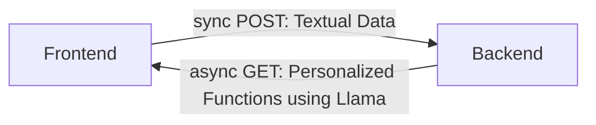
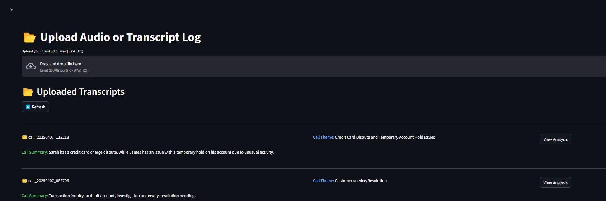

# __LLM Call Analysis Architecture__

__App Overview__

__Frontend-Backend interaction__

## __Usage of LLM in the project__: 

Llm is used for the following 2 functionalities:-

- __Call summarization and call theme identification__: Utilize llama3 to identify call summary and the call theme for better readability on the homepage. Sample shown below

- __Individual call level analysis__: added a `Smart Analysis` module within the analytics page to allow the user to query specific analysis related to the call and return the relevant text or graph plots. The llm analyses the question and returns the list of function/s to be called. The functionalities covered are listed below.

## __Queries Covered in Smart Analysis__

---

### `show_sentiment(sentiment_count, speaker)`

**Description**: Plot sentiment analysis as graphs.

**Parameters**:

- `sentiment_count`:  A dictionary containing sentiment related information for speakers.

- `speaker`: Allowed values are `"Net"`, `"Handler"`, `"Client"`  

- `sentiment_type`: Allowed values are `"all"`, `"positive"`, `"neutral"`, `"negative"`

**Sample Questions**: 
`Show sentiment analysis`(also calls *show_sentiment_text()*), `show sentiment analysis for client`(also calls *show_sentiment_text()*), `Plot negetive sentiment for handler`

---

### `show_sentiment_text(sentiment_count, speaker)`

**Description**: Show sentiment analysis as text summary.

**Parameters**:

- `sentiment_count`: A dictionary containing sentiment related information for speakers.  
- `speaker`: Allowed values are `"Net"`, `"Handler"`, `"Client"`  
- `sentiment_type`: Allowed values are `"all"`, `"positive"`, `"neutral"`, `"negative"`

**Sample Questions**:  
`Show sentiment analysis`(also calls *show_sentiment()*), `show sentiment analysis for client`(also calls *show_sentiment()*), `show negetive sentiment of handler as text`

---

### `get_count_message(attr_json, count_type)`

**Description**: Get count statistics for specific conversation elements like greeting, disclaimer, closure, and PII violations.

**Parameters**:

- `attr_json`: A dictionary containing various attribute related information like greeting, disclaimer, closure, PII.  
- `count_type`: Allowed values are `"greeting"`, `"disclaimer"`, `"closure"`, `"pii"`

**Sample Questions**:  
`Number of disclaimers`, `Count the PII violations`, `How many times was the greeting used?`

---

### `show_time_split(attr_json, speaker)`

**Description**: Show talk time distribution between handler and client.

**Parameters**:

- `attr_json`: A dictionary containing various attribute related information like greeting, disclaimer, closure, PII.  
- `speaker`: Allowed values are `"all"`, `"handler"`, `"client"`

**Sample Questions**:  
`What is the distribution of talk time`, `How much time did handler speak?`, `Total time spoken by client`

---

### `show_conversation_speed(attr_json, speaker)`

**Description**: Show conversation speed in words per second.

**Parameters**:

- `attr_json`: A dictionary containing various attribute related information like greeting, disclaimer, closure, PII.  
- `speaker`: Allowed values are `"all"`, `"handler"`, `"client"`

**Sample Questions**:  
`Compare speaking speed`, `What’s the agent's talking speed?`, `how fast was client talking`

---

### `analyze_signs(attr_json, sign_type)`

**Description**: Analyze/show good and bad signs in the conversation.

**Parameters**:

- `attr_json`: A dictionary containing various attribute related information like greeting, disclaimer, closure, PII.  
- `sign_type`: Allowed values are `"all"`, `"good_signs"`, `"bad_signs"`

**Sample Questions**:  
`Show good signs`, `What are the bad signs in this call?`, `Show all call signs`

---

### `get_dialog_instance(conversation_json, dialog_type)`

**Description**: Get specific dialog instances from the conversation like greeting, disclaimer, closure, prohibited words, and PII violations.

**Parameters**:

- `conversation_json`: A list containing call conversation level information for each dialog.  
- `dialog_type`: Allowed values are `"greeting"`, `"disclaimer"`, `"closure"`, `"prohibited_words"`, `"pii"`

**Sample Questions**:  
`Where was the greeting used?`, `Show all disclaimers`, `Show all disclaimer and greeting` *(this query calls get_dialog_instance() twice once with disclaimer parameters and once with greeting parameters and renders them one after other in the chat)*

---

  - [__<- Table of Content__](index.md)
  - [__App Functionality ->__](functionality.md)

